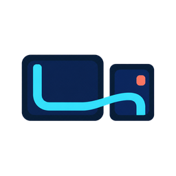
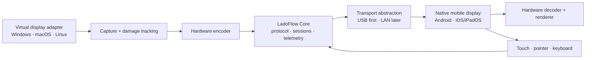

<p align="center">
  
</p>

<h1 align="center">LadoFlow</h1>

<p align="center">
  <strong>Use the screen beside you as a smooth, private second display.</strong>
</p>

<p align="center">
  USB first · local only · no account · open source
</p>

<p align="center">
  <a href="./README.md">English</a> ·
  <a href="./README.es.md">Español</a> ·
  <a href="./README.zh-CN.md">简体中文</a>
</p>

<p align="center">
  <a href="https://github.com/tianrking/LadoFlow/actions/workflows/ci.yml"></a>
  <a href="./LICENSE"></a>
  
  
</p>

> [!IMPORTANT]
> LadoFlow is in **pre-alpha foundation work**. There is no usable second-display release yet. The table below distinguishes implemented foundations from planned platform support.

## What LadoFlow is

LadoFlow is building a local-first second-display system for:

- Windows, macOS, and Linux hosts;
- Android tablets and phones;
- iPad and iPhone displays;
- wired USB transport first, then trusted local-network transport;
- hardware video encoding/decoding, touch and pointer input, and automatic reconnection.

The long-term product promise is simple: install the host, open LadoFlow on a tablet, plug in a cable, and extend the desktop—without an account or a cloud relay.

## Project status

| Area | Current state | Intended result |
| --- | --- | --- |
| Shared wire protocol | M1 payloads and bounded framing implemented | Versioned control, media, input, and telemetry messages |
| Shared runtime | Negotiation, sessions, reconnect policy, telemetry, pacing, and bounded loopback implemented | Platform-neutral runtime used by every host and display |
| Desktop host | Runnable Tauri 2 loopback and diagnostics UI | One shell with target-gated native services |
| macOS host | Permission/display discovery plus a real ScreenCaptureKit IOSurface probe and local app bundle | Long-running capture/VideoToolbox pipeline, native virtual-display adapter, and notarized host |
| Windows host | Physical-hardware-verified capture/GPU H.264/input plus a build-verified one-monitor IddCx driver, LocalSystem lifecycle service, bounded IPC client, and automatic Tauri virtual-monitor selection | Trusted driver installation, clean-machine recovery tests, and production signing |
| Linux host | Architecture only | Wayland/X11/DRM-compatible host paths |
| Android display | Architecture only | Native Kotlin receiver with hardware decode and touch |
| iOS/iPadOS display | Architecture only | Native Swift receiver with hardware decode and touch |
| USB transport | Tested AOA 1/2 negotiation, cancellable Windows bulk I/O, ordered control/media, live H.264 packets, and capability-gated Windows input injection; physical-device proof remains unfinished | Direct, authenticated device link |
| Wi-Fi/LAN transport | Planned after USB | Explicitly paired local connection |

No row above is a release claim. Follow the [roadmap](./docs/roadmap.md) and [GitHub milestones](https://github.com/tianrking/LadoFlow/milestones) for evidence-backed progress.

## Architecture



Platform-specific display drivers and USB adapters remain native. Session state, wire framing, capability negotiation, and quality control live in the shared Rust core. Mobile presentation and hardware decoding stay native to Kotlin and Swift.

Read the full [architecture](./docs/architecture.md) and [protocol principles](./docs/protocol.md).

## Why the name?

**Lado** means “side” or “beside” in Spanish; **flow** describes the low-friction movement of pixels and input between devices. Together, LadoFlow means *a display at your side that stays in your flow*.

The logo uses two adjacent rounded screens joined by one continuous cyan path:

- the large frame is the host computer;
- the smaller frame is the tablet or phone;
- the continuous path forms a subtle **L** and represents local transport;
- cyan represents motion and responsiveness; coral marks the connected display endpoint;
- the design contains no platform or third-party product marks.

More detail and downloadable assets live in the [brand guide](./docs/brand.md).

## Repository layout

```text
LadoFlow/
├─ apps/                 # Desktop, Android, and Apple applications
├─ crates/               # Shared Rust protocol, core, transport, and media crates
├─ platform/             # Native virtual-display and OS integration components
├─ assets/brand/         # Original logo assets
├─ docs/                 # Architecture, protocol, roadmap, and development notes
└─ .github/workflows/    # Reproducible validation
```

## Development principles

1. **Measure before claiming.** Smoothness means captured latency, frame pacing, drops, and reconnect behavior—not a demo video.
2. **Native where the platform demands it.** Drivers, codecs, rendering, USB integration, and input injection use native APIs.
3. **Share only stable logic.** Protocol and session behavior are shared; platform UI is not forced into one abstraction.
4. **Local by default.** No account, analytics, or cloud relay is required for the core product.
5. **Small, testable commits.** Each milestone must include a repeatable validation path.

## Run the current desktop foundation

Install Rust 1.97.1, Node.js LTS, pnpm 10.26.0, and the
[Tauri prerequisites](https://v2.tauri.app/start/prerequisites/) for your OS.
Then run:

```bash
pnpm install --frozen-lockfile
pnpm check
pnpm dev:desktop
```

Without a physical link, the desktop application negotiates a real loopback
session and drives synthetic frames through the bounded media transport while
showing live pacing, drop, and latency telemetry. On Windows, an established
Android Open Accessory link instead captures the selected monitor, converts its
D3D11 surface to NV12 on the GPU, hardware-encodes H.264 Main, and sends the
access units through the same ordered protocol runtime. That native path is
physically verified on the Windows host. The separate IddCx source now builds,
passes Universal API/INF validation, produces a development catalog, and has a
LocalSystem owner plus PID-verified JSON IPC client; this machine still runs in
existing-monitor mirror mode until the driver and service are installed on a
controlled test host. The Windows Tauri shell now exposes structured service and
monitor state, enables or disables the virtual display through that client, and
automatically selects the resulting virtual monitor. Its unsigned NSIS artifact
contains the driver, service, and controller resources, but the current package
does not register them with Windows. Windows-to-Android
USB has not yet been verified on a physical device. See
[development setup](./docs/development.md) and the
[platform handoff](./docs/platform-handoff.md).

## Security and privacy

LadoFlow is designed for explicit pairing and local transport. Wireless support will not silently expose a listening service to untrusted networks. Please report vulnerabilities privately using the instructions in [SECURITY.md](./SECURITY.md).

## Contributing

The project is early, but architecture discussions, reproducible latency measurements, device compatibility reports, and focused patches are welcome. Read [CONTRIBUTING.md](./CONTRIBUTING.md) before opening a pull request.

## License

LadoFlow is available under the [MIT License](./LICENSE). The name and logo are project identity assets; redistribution must not imply endorsement by the LadoFlow project.
