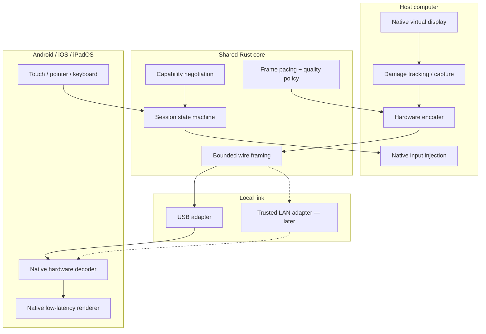
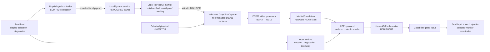

# Architecture

## Objective

LadoFlow turns a mobile device into an extended desktop display. A host must create or attach to a virtual display, capture changed frames, encode them using available hardware, transport them locally, and present them with stable pacing on the mobile device. Input follows the reverse path.

The architecture is split so platform restrictions do not leak into the wire protocol.

## Current implementation slice

Loopback remains the cross-platform fallback, but Windows now has a real native
media and input composition path:

The selected-display capture, GPU conversion, Intel Quick Sync encoding, wire
composition, and native Windows input path have physical-host evidence. The
IddCx project separately compiles one stable virtual monitor, passes Universal
API and INF validation, generates a development catalog, and exposes a JSON
start/status/stop client over a versioned privileged-service boundary. The pipe
rejects remote clients and the client verifies its server against SCM's PID. It
has been integrated into the Tauri lifecycle: structured status is polled with a
short cache, enable waits for a real virtual `HMONITOR`, and the resulting source
is selected automatically. It has not yet been trusted and installed on this
machine, so true extended-desktop behavior is not counted as physically proven.

The USB path enforces monotonically increasing sequence numbers per sender,
uses an operating-system random session nonce, validates active input,
telemetry, ping/pong, and error frames, and reports failures to the desktop UI.
Raw byte-stream adapters share one bounded LDFL decoder and one control/media
multiplexer in `ladoflow-transport`; USB bulk and future TCP links therefore
derive channels and restore global wire order with the same fail-closed rules.
After an explicitly started session loses its bulk connection, the Windows
composition layer tears down the native media/input generation and performs a
cancellable, exponentially backed-off AOA reopen against a 60-second retry
deadline; an in-flight bounded USB or protocol operation is allowed to return
before the final failure is published. A reopened physical transport always
negotiates a fresh protocol generation; no old sequence cursor or encoded-frame
queue crosses the disconnect. Passive USB status remains read-only. The
remaining proof boundary is a sustained physical Windows-to-Android
detach/reattach run.

The implementation lives in these ownership boundaries:

| Boundary | Location | Owns |
| --- | --- | --- |
| Wire protocol | `crates/ladoflow-protocol` | Bounded framing and versioned payloads |
| Session policy | `crates/ladoflow-core` | Negotiation, lifecycle, continuity, quality, telemetry |
| Media policy | `crates/ladoflow-media` | Codec-neutral metadata, pacing, scheduling, synthetic diagnostics |
| Link policy | `crates/ladoflow-transport` | Control/media channels, queue limits, supersession, reconnect |
| Desktop composition | `apps/desktop/src-tauri` | Tauri commands, worker lifecycle, platform adapter selection |
| Native integrations | `apps/desktop/src-tauri/src/platform` and `platform/` | OS APIs, services, and drivers |

## Boundaries

### Platform-native

- virtual display creation and lifecycle;
- desktop capture and damage regions;
- hardware video encode/decode;
- mobile rendering and refresh synchronization;
- USB device APIs and installation behavior;
- touch, keyboard, and pointer injection;
- driver signing, app signing, notarization, and packaging.

### Shared

- protocol version and feature negotiation;
- bounded message framing and parsing;
- session transitions and reconnect semantics;
- codec-neutral frame metadata;
- telemetry schema and latency timestamps;
- adaptive quality policy inputs and outputs.

## Control plane and media plane

Control messages are small, reliable, ordered, and bounded. They cover hello/version negotiation, capabilities, display configuration, session state, input, ping/pong, and errors.

Media frames are larger and latency-sensitive. The transport may drop obsolete delta frames rather than building an unbounded queue. Keyframe requests and decoder resets remain reliable control messages.

## Latency budget

The initial 60 Hz engineering target—not a current result—is an interactive glass-to-glass median below 50 ms on supported wired hardware, with stable frame pacing more important than a misleading best-case sample.

Every milestone must record at least:

- capture timestamp;
- encode start/end;
- transport enqueue/dequeue;
- decode start/end;
- presentation timestamp;
- dropped, superseded, and late frames;
- reconnect duration.

## Platform strategy

### Windows

Use the supported Indirect Display Driver model where practical. The signed driver and privileged service remain native; the desktop UI does not run inside the driver process.

The current adapter discovers monitors through Win32 and runs selected-monitor
capture with a hardware D3D11 device and a free-threaded
`Windows.Graphics.Capture` frame pool. It converts to NV12 on the GPU, feeds a
low-latency Media Foundation hardware H.264 encoder, and sends real access
units through the USB runtime. The native input sink maps pointer, keyboard,
wheel, and touch events back to the selected monitor.

`platform/windows/idd` now contains a separate UMDF 2 IddCx driver, LocalSystem
software-device lifecycle service, fixed-size v1 IPC contract, and unprivileged
JSON controller. Its driver frame loop acknowledges DWM surfaces quickly; the
desktop host captures the resulting virtual `HMONITOR` through the same verified
WGC/encoder path. Source/build and non-installing service/IPC validation are
complete. The Tauri shell now owns bounded enable/disable calls, structured
status, virtual-monitor discovery, and automatic source selection. The unsigned
Windows bundle contains all native resources and uses a per-machine NSIS hook
plus a static native setup helper for driver-store and service operations. The
helper records the published OEM INF and hash so uninstall never guesses a
driver package. Its build, self-tests, and non-mutating plans pass; trusted
clean-machine installation, rollback execution, signing, and physical
extended-display evidence remain release gates.

### macOS

Keep virtual-display integration isolated behind a native adapter because public API availability and distribution constraints can change by OS version. Signing and notarization are release gates, not afterthoughts.

The current adapter uses CoreGraphics for permission preflight/request and
active-display metadata. Its short ScreenCaptureKit probe verifies native
IOSurface-backed callbacks while exposing only aggregate diagnostics to the UI.
The production frame loop and hardware encoding still belong behind native
ScreenCaptureKit and VideoToolbox boundaries; neither API or pixel buffer is
surfaced directly to TypeScript.

### Linux

Support will be backend-specific. Wayland compositors, X11, and DRM virtual outputs cannot be represented as one universal installer without platform checks.

### Android

Use Kotlin, MediaCodec, Surface/SurfaceTexture rendering, and Android USB APIs. The release path must not require developer mode or ADB.

### iOS/iPadOS

Use Swift, VideoToolbox/AVFoundation where applicable, Metal rendering, and App Store-compatible device communication. Private host-side techniques must not leak into the mobile App Store binary.

## Security model

- A new display device requires explicit local approval.
- Session secrets are ephemeral and scoped to a paired host/display relationship.
- Network listeners bind conservatively and authenticate before accepting display data.
- Parsers reject unknown versions, oversized messages, invalid lengths, and resource-exhaustion patterns.
- Captured pixels remain local unless a future remote mode is separately designed and enabled.
