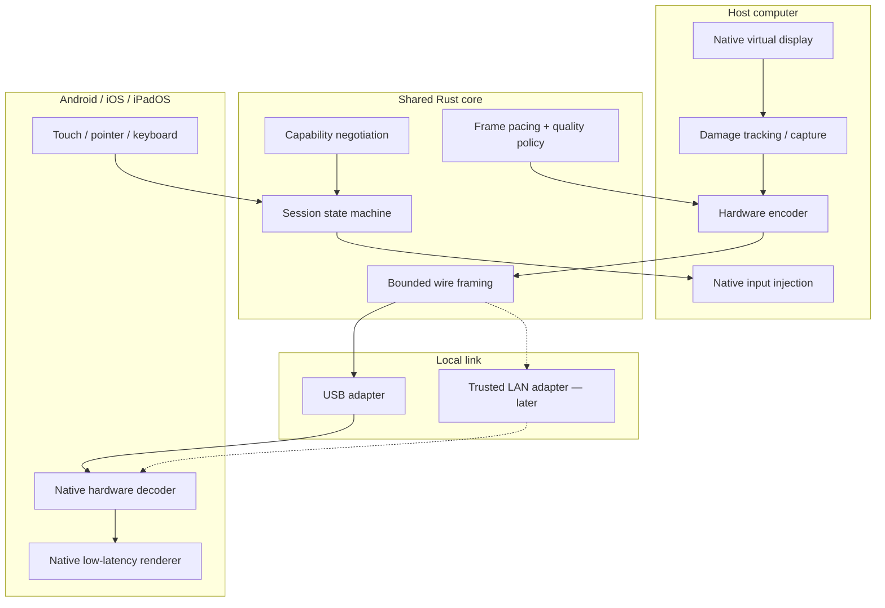
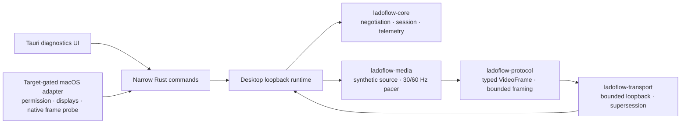

# Architecture

## Objective

LadoFlow turns a mobile device into an extended desktop display. A host must create or attach to a virtual display, capture changed frames, encode them using available hardware, transport them locally, and present them with stable pacing on the mobile device. Input follows the reverse path.

The architecture is split so platform restrictions do not leak into the wire protocol.

## Current implementation slice

The first executable slice deliberately substitutes synthetic media and an
in-memory data link for unfinished production capture and mobile presentation.
The AOA USB control plane and persistent bulk-session boundary are now
implemented separately, but the desktop runtime does not enqueue its media
stream into that session yet:

This path exercises the shared contracts end to end without pretending to be a
usable second display. Native frame sources will replace `SyntheticFrameProducer`;
The verified AOA mode-switch and bounded bulk-transfer worker will replace the
loopback pair after its host endpoint is composed into the runtime; neither USB
nor a later LAN adapter should change session or wire semantics.

The implementation lives in these ownership boundaries:

| Boundary | Location | Owns |
| --- | --- | --- |
| Wire protocol | `crates/ladoflow-protocol` | Bounded framing and versioned payloads |
| Session policy | `crates/ladoflow-core` | Negotiation, lifecycle, continuity, quality, telemetry |
| Media policy | `crates/ladoflow-media` | Codec-neutral metadata, pacing, scheduling, synthetic diagnostics |
| Link policy | `crates/ladoflow-transport` | Control/media channels, queue limits, supersession, reconnect |
| Desktop composition | `apps/desktop/src-tauri` | Tauri commands, worker lifecycle, platform adapter selection |
| Native integrations | `apps/desktop/src-tauri/src/platform` and `platform/` | OS APIs, services, and drivers |

## Boundaries

### Platform-native

- virtual display creation and lifecycle;
- desktop capture and damage regions;
- hardware video encode/decode;
- mobile rendering and refresh synchronization;
- USB device APIs and installation behavior;
- touch, keyboard, and pointer injection;
- driver signing, app signing, notarization, and packaging.

### Shared

- protocol version and feature negotiation;
- bounded message framing and parsing;
- session transitions and reconnect semantics;
- codec-neutral frame metadata;
- telemetry schema and latency timestamps;
- adaptive quality policy inputs and outputs.

## Control plane and media plane

Control messages are small, reliable, ordered, and bounded. They cover hello/version negotiation, capabilities, display configuration, session state, input, ping/pong, and errors.

Media frames are larger and latency-sensitive. The transport may drop obsolete delta frames rather than building an unbounded queue. Keyframe requests and decoder resets remain reliable control messages.

## Latency budget

The initial 60 Hz engineering target—not a current result—is an interactive glass-to-glass median below 50 ms on supported wired hardware, with stable frame pacing more important than a misleading best-case sample.

Every milestone must record at least:

- capture timestamp;
- encode start/end;
- transport enqueue/dequeue;
- decode start/end;
- presentation timestamp;
- dropped, superseded, and late frames;
- reconnect duration.

## Platform strategy

### Windows

Use the supported Indirect Display Driver model where practical. The signed driver and privileged service remain native; the desktop UI does not run inside the driver process.

The current adapter discovers monitors through Win32 and verifies selected-
monitor capture with a hardware D3D11 device and a free-threaded
`Windows.Graphics.Capture` frame pool. GPU surfaces stay native; only aggregate
probe diagnostics cross into TypeScript. A second native probe verifies a real
hardware Media Foundation NV12-to-H.264 bitstream and handles asynchronous
output renegotiation. The long-running zero-copy connection between those two
probes and the IddCx service/driver remain separate boundaries.

### macOS

Keep virtual-display integration isolated behind a native adapter because public API availability and distribution constraints can change by OS version. Signing and notarization are release gates, not afterthoughts.

The current adapter uses CoreGraphics for permission preflight/request and
active-display metadata. Its short ScreenCaptureKit probe verifies native
IOSurface-backed callbacks while exposing only aggregate diagnostics to the UI.
The production frame loop and hardware encoding still belong behind native
ScreenCaptureKit and VideoToolbox boundaries; neither API or pixel buffer is
surfaced directly to TypeScript.

### Linux

Support will be backend-specific. Wayland compositors, X11, and DRM virtual outputs cannot be represented as one universal installer without platform checks.

### Android

Use Kotlin, MediaCodec, Surface/SurfaceTexture rendering, and Android USB APIs. The release path must not require developer mode or ADB.

### iOS/iPadOS

Use Swift, VideoToolbox/AVFoundation where applicable, Metal rendering, and App Store-compatible device communication. Private host-side techniques must not leak into the mobile App Store binary.

## Security model

- A new display device requires explicit local approval.
- Session secrets are ephemeral and scoped to a paired host/display relationship.
- Network listeners bind conservatively and authenticate before accepting display data.
- Parsers reject unknown versions, oversized messages, invalid lengths, and resource-exhaustion patterns.
- Captured pixels remain local unless a future remote mode is separately designed and enabled.
